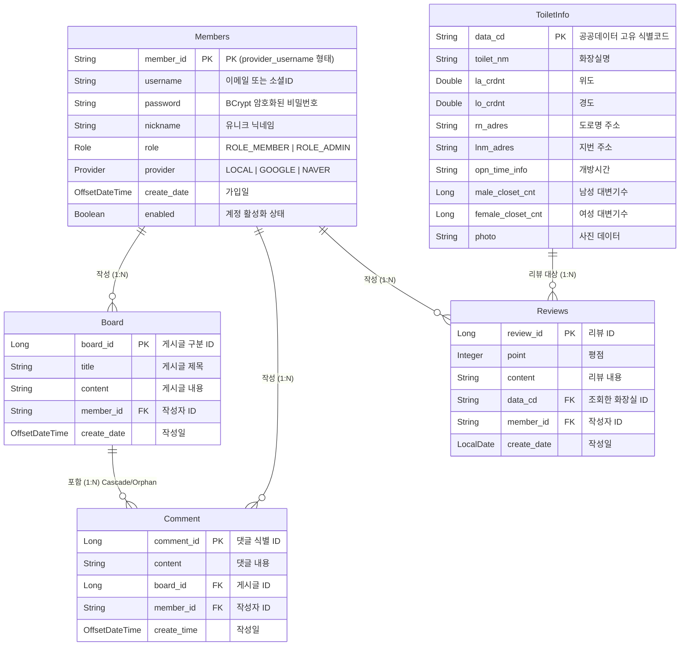

# 프로젝트 분석 보고서: KDT_MiniProject (화장실 정보 및 커뮤니티 애플리케이션)

이 보고서는 `KDT_MiniProject` 백엔드 프로젝트의 소스 코드를 바탕으로 아키텍처, 기술 스택, 엔티티 설계(ERD) 및 구현 세부 사항을 정리한 문서입니다.

---

## 1. 프로젝트 개요

**KDT_MiniProject**는 공용 화장실의 위치 및 상태 정보를 제공하고, 사용자가 해당 화장실에 대해 리뷰를 남기며 소통할 수 있는 **웹 서비스의 백엔드 시스템**입니다. Spring Boot 프레임워크를 기반으로 구축되었으며, 클라우드 데이터베이스(Supabase PostgreSQL) 환경을 활용합니다. JSON 기반의 무상태(Stateless) REST API로 구현되었습니다.

---

## 2. 주요 기술 스택 (Tech Stack)

### 2.1 Backend Core
- **언어**: Java 21
- **프레임워크**: Spring Boot 3.5.8
- **빌드 도구**: Maven

### 2.2 Database & ORM
- **데이터베이스**: PostgreSQL (Supabase 클라우드 호스팅 기반)
  - 풀링(Pooling) 설정: HikariCP (Max pool size: 3)
- **ORM**: Spring Data JPA, Hibernate
- **매핑 방식**: 엔티티 관계(OneToMany, ManyToOne) 및 지연 로딩(FetchType.LAZY) 활용

### 2.3 Security & Authentication
- **인증 방식**: JWT (JSON Web Token), `com.auth0:java-jwt` 라이브러리 사용
- **보안 프레임워크**: Spring Security
- **소셜 로그인**: OAuth 2.0 Client (Google, Naver 연동 지원)
- **비밀번호 암호화**: BCryptPasswordEncoder 기반 단방향 해시

### 2.4 Utilities & DevOps
- **코드 자동화**: Lombok (Getter, Setter, Builder 패턴 제어)
- **API 문서화**: SpringDoc OpenAPI (Swagger UI)를 통한 API 엔드포인트 자동화 가이드
- **CORS 및 프록시**: `server.forward-headers-strategy=framework`, Ngrok, Vercel 프론트엔드 환경 호환성 확보

---

## 3. 핵심 엔티티 구조 및 다이어그램 (ERD)

애플리케이션은 총 5개의 핵심 도메인(Entity)으로 구성되어 있습니다. 각각의 도메인은 무결성을 보장하기 위해 외래키(FK) 관계로 연결되어 있습니다.

---

## 4. 기능별 아키텍처 및 구현 세부사항

### 4.1 회원 관리 시스템 (MemberService & Authentication)
- **다중 인증 시스템**: `LOCAL` (일반 자체 로그인) 방식과 소셜 로그인(`GOOGLE`, `NAVER`) 방식을 `Provider` Enum으로 통합하여 관리합니다.
- **아이디 식별 규칙**: 동일한 이메일을 통한 충돌을 방지하고자, 기본키(`member_id`)를 `[Provider]_[Username]` 형식으로 자동 병합하여 저장합니다. 
- **예외 처리 통합**: 닉네임, 유저네임 중복 발생 시 커스텀 예외(`NicknameDuplicateException`, `UsernameDuplicateException`)를 던져 `GlobalExceptionController`에서 일관성 있게 클라이언트로 메시지를 응답합니다.

### 4.2 공중 화장실 정보 매핑 (ToiletInfo)
- **데이터 대량 초기화 (`DummyInit`)**: 애플리케이션 초기 구축 또는 테스트 용도로 외부 JSON 파일을 읽어 데이터베이스를 초기화할 수 있는 더미 데이터 로더를 지원합니다.
- **다양한 정보 속성 처리**: 공공데이터 규격에 맞게 위경도, 읍면동명, 관리기관, 오물처리방식, 기저귀교환대 여부, 장애인용 변기 수 등 다수의 컬럼을 `@Immutable` 엔티티로 구성하여 관리합니다.

### 4.3 게시판 및 커뮤니티 (Board & Comment)
- **영속성 전이(Cascade) 활용**: `Board` 엔티티를 삭제할 경우 연관된 모든 `Comment` 엔티티가 `CascadeType.ALL` 및 `orphanRemoval = true` 설정을 통해 함께 삭제되도록 구성되었습니다.
- **N+1 문제 대비**: 연관 관계 조회 시 `@BatchSize(size = 100)` 어노테이션을 사용하여 게시판의 댓글 목록을 가져올 때 일어날 수 있는 페치 성능 저하와 N+1 Select 문제를 예방하였습니다.

### 4.4 리뷰 시스템 (Review & Rating)
- **관계 매핑**: 리뷰 작성 시 대상이 되는 `ToiletInfo`의 기본키(`data_cd`)와 작성자 `Members`의 식별키(`member_id`)를 조인하여 저장합니다.
- **데이터 패치 제어**: `@ManyToOne` 조인 속성에서 `FetchType.LAZY`를 선언하여 지연 로딩을 적용했습니다.

---

## 5. 아키텍처 특장점 분석

1. **DTO 레이어 분리** 
   - 사용자의 Request와 서버의 Response가 엔티티 구조로 직접 유출되지 않도록, 컨트롤러와 서비스 레이어간의 통신은 별도의 DTO(`MemberDTO`, `ToiletReqDTO` 등)를 사용하도록 구성했습니다.
2. **RESTful 규칙 엄수** 
   - `ResponseEntity<?>`를 적극 활용하여, 각 메소드의 성공, 권한 부족, 유효성 실패 등의 상태를 적절한 HTTP Status 코드로 일관성 있게 전달합니다.
3. **CORS 및 쿠키 정책 반영**
   - 프론트엔드 연동을 위해 `application.properties` 에서 쿠키 속성(`SameSite=None`, `Secure=True`, `HttpOnly=True`)을 설정하였습니다.

---
**작성일**: 2026-02-28  
**대상 버전**: `0.0.1-SNAPSHOT`
